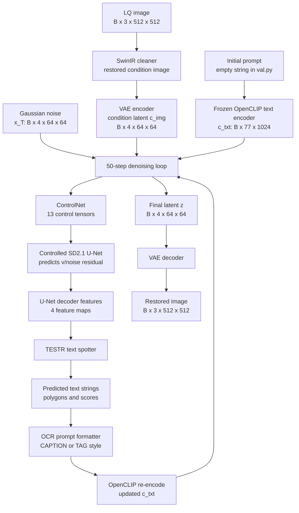
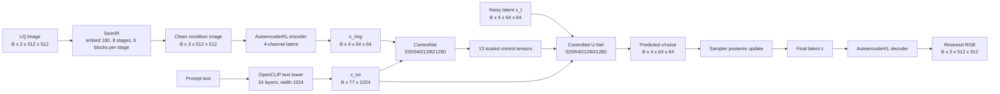
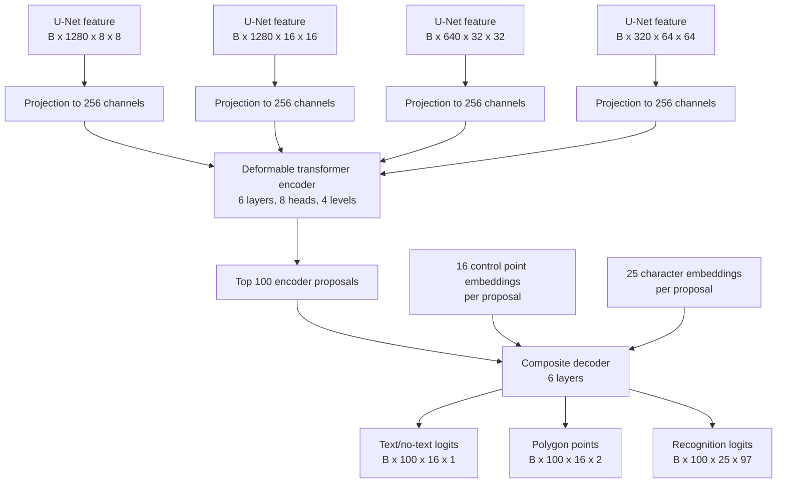
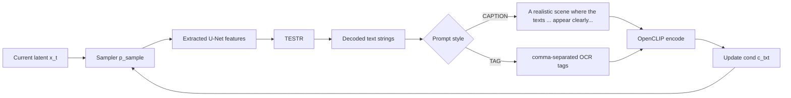

# TeReDiff Architecture Report

This report documents the TeReDiff architecture configured in this repository for
Stage 3 text-aware image restoration. It is based on the default validation
configuration in `configs/val/local_val_terediff.yaml` and the model code under
`terediff/` and `testr/`.

## Configuration Baseline

| Item | Value |
| --- | --- |
| Main config | `configs/val/local_val_terediff.yaml` |
| Model variant | `terediff_stage3` |
| Input/output image size used by demo and training code | 512 x 512 |
| Latent scale factor | 8 pixels per latent cell |
| Diffusion timesteps | 1000 training timesteps |
| Sampling in `val.py` | 50 spaced sampling steps |
| Diffusion parameterization | `v` |
| Noise schedule | Linear beta, `0.00085` to `0.0120`, zero-SNR enabled |
| Text prompt source at inference | Repeated OCR feedback from TESTR during sampling |

## High-Level Dataflow



TeReDiff couples a latent diffusion restoration model with a text spotting
module. The key implementation detail is that TESTR does not read the restored
RGB image during sampling. It reads intermediate U-Net decoder feature maps,
predicts scene text, and those predicted strings are converted into the next
CLIP text prompt.

## Module Inventory

| Module | Implementation | Role | Training status in Stage 3 |
| --- | --- | --- | --- |
| SwinIR cleaner | `terediff.model.swinir.SwinIR` | Produces a cleaner 512 x 512 conditioning image from the LQ input. | Frozen |
| VAE | `terediff.model.vae.AutoencoderKL` | Encodes images to 4-channel latents and decodes final latents to RGB. | Frozen |
| OpenCLIP | `terediff.model.clip.FrozenOpenCLIPEmbedder` | Encodes text prompts into cross-attention context. | Frozen |
| Controlled U-Net | `terediff.model.controlnet.ControlledUnetModel` | SD2.1-style denoising U-Net; also exports four decoder feature maps for TESTR. | U-Net attention layers trainable |
| ControlNet | `terediff.model.controlnet.ControlNet` | Processes condition latent and injects 13 zero-conv control tensors into the U-Net. | Trainable |
| Diffusion scheduler | `terediff.model.gaussian_diffusion.Diffusion` and `terediff.sampler.SpacedSampler` | Adds training noise and performs spaced denoising at inference. | No learned parameters |
| TESTR | `testr.adet.modeling.transformer_detector.TransformerDetector` | Predicts text polygons and character sequences from U-Net features. | Trainable |

## Tensor Dimensions

For the default 512 x 512 path used by `train.py` and `val.py`:

| Tensor | Shape | Source |
| --- | --- | --- |
| Ground-truth image | `B x 3 x 512 x 512` | Training target |
| Low-quality image after preprocessing | `B x 3 x 512 x 512` | Input to SwinIR |
| SwinIR output / condition image | `B x 3 x 512 x 512` | Input to VAE condition encoder |
| Condition latent `c_img` | `B x 4 x 64 x 64` | VAE encode of SwinIR output |
| Clean latent `z_0` | `B x 4 x 64 x 64` | VAE encode of HQ image during training |
| Noisy latent `x_t` / sampling latent `x` | `B x 4 x 64 x 64` | Diffusion state |
| Text context `c_txt` | `B x 77 x 1024` | OpenCLIP text encoder |
| U-Net extracted feature 1 | `B x 1280 x 8 x 8` | U-Net output block index 2 |
| U-Net extracted feature 2 | `B x 1280 x 16 x 16` | U-Net output block index 5 |
| U-Net extracted feature 3 | `B x 640 x 32 x 32` | U-Net output block index 8 |
| U-Net extracted feature 4 | `B x 320 x 64 x 64` | U-Net output block index 11 |
| TESTR feature projections | four tensors with 256 channels | 1x1 conv, GN, GELU, 3x3 conv, GN, GELU |
| TESTR class logits | `B x 100 x 16 x 1` | 100 proposals, 16 polygon control points |
| TESTR polygon points | `B x 100 x 16 x 2` | Normalized then scaled to 512 x 512 |
| TESTR text logits | `B x 100 x 25 x 97` | 25 chars, vocabulary 96 plus blank |

## Restoration Module Architecture



### SD2.1-Style Controlled U-Net

The U-Net is configured as a latent diffusion U-Net with:

| Field | Value |
| --- | --- |
| Input channels | 4 |
| Output channels | 4 |
| Base channels | 320 |
| Channel multipliers | `[1, 2, 4, 4]` |
| Channel ladder | 320, 640, 1280, 1280 |
| Residual blocks per level | 2 |
| Attention resolutions | downsample factors `[4, 2, 1]` |
| Spatial transformer depth | 1 |
| Cross-attention context dimension | 1024 |
| Attention head channel width | 64 |
| Input blocks | 12 |
| Middle block | 1 |
| Output blocks | 12 |

The output decoder blocks at indices 2, 5, 8, and 11 are exported to TESTR.
These form a coarse-to-fine feature pyramid: 8 x 8, 16 x 16, 32 x 32, and
64 x 64.

### ControlNet

ControlNet mirrors the U-Net down path and middle block. It receives the noisy
latent and condition latent concatenated along channels:

```text
x_t:   B x 4 x 64 x 64
c_img: B x 4 x 64 x 64
input: B x 8 x 64 x 64
```

It produces 12 zero-conv outputs from input blocks plus one middle-block output,
for 13 control tensors total. `ControlLDM.control_scales` defaults to 13 values.

### VAE

The VAE is the SD-style `AutoencoderKL` configured with:

| Field | Value |
| --- | --- |
| `embed_dim` | 4 |
| `z_channels` | 4 |
| Base channels | 128 |
| Channel multipliers | `[1, 2, 4, 4]` |
| Residual blocks per level | 2 |
| Attention resolutions | none in this config |
| Latent scaling factor | 0.18215 |

### Frozen OpenCLIP

The text condition comes from the frozen OpenCLIP text tower:

| Field | Value |
| --- | --- |
| Text context length | 77 |
| Text vocabulary size | 49,408 |
| Text width | 1024 |
| Text heads | 16 |
| Text layers | 24 |
| Output used | Penultimate layer |

The config also includes a ViT-H-like vision configuration, but the restoration
path uses the text embeddings for cross-attention conditioning.

### SwinIR Cleaner

SwinIR provides the restored condition image before latent diffusion:

| Field | Value |
| --- | --- |
| Input channels | 3 |
| Patch size | 1 |
| Embed dimension | 180 |
| Depths | `[6, 6, 6, 6, 6, 6, 6, 6]` |
| Heads | `[6, 6, 6, 6, 6, 6, 6, 6]` |
| Window size | 8 |
| MLP ratio | 2 |
| Upsampler | `nearest+conv` |
| Scale factor | 8 |
| Pixel-unshuffle | enabled, scale 8 |

## TESTR Text Spotting Architecture



TESTR is configured by `testr/configs/TESTR/TESTR_R_50_Polygon.yaml` and its
base configs. In this TeReDiff integration, the conventional image backbone is
not used in the forward path. The detector receives U-Net feature tensors via
`TransformerDetector.forward(extracted_feats, targets, MODE)`.

| Field | Value |
| --- | --- |
| Feature inputs | 4 U-Net decoder feature maps |
| Input feature channels | `[1280, 1280, 640, 320]` |
| Projection output channels | 256 |
| Feature levels | 4 |
| Encoder layers | 6 |
| Decoder layers | 6 |
| Hidden dimension | 256 |
| Feed-forward dimension | 1024 |
| Attention heads | 8 |
| Encoder sampling points | 4 |
| Decoder sampling points | 4 |
| Object proposals | 100 |
| Polygon control points | 16 |
| Max text length | 25 |
| Vocabulary size | 96 plus blank, giving 97 logits |
| Inference threshold in demo | 0.5 in `val.py` |

## Text-Aware Feedback Loop



During validation sampling, `SpacedSampler.val_sample()` runs TESTR at every
denoising step. The predicted strings are decoded, formatted into a prompt, and
then encoded through the frozen CLIP text tower. The updated `cond["c_txt"]`
is used on the next denoising step.

## Parameter Counts

The following counts were generated in this workspace without loading model
checkpoints. The command instantiated modules from
`configs/val/local_val_terediff.yaml` and summed `p.numel()` for each module.

| Module | Parameters | Approx. |
| --- | ---: | ---: |
| ControlLDM total | 1,666,750,508 | 1666.751M |
| SD2.1 U-Net / ControlledUnetModel | 865,910,724 | 865.911M |
| ControlNet | 363,153,280 | 363.153M |
| AutoencoderKL VAE | 83,653,863 | 83.654M |
| Frozen OpenCLIP embedder | 354,032,641 | 354.033M |
| SwinIR cleaner | 15,792,587 | 15.793M |
| TESTR / TransformerDetector | not counted in this shell | see note below |

TESTR counting was attempted with both local source paths inserted:

```text
sys.path.insert(0, "<repo>/detectron2")
sys.path.insert(0, "<repo>/testr")
```

The import failed with:

```text
ImportError: cannot import name '_C' from 'testr.adet'
```

This indicates the local TESTR/Detectron2 compiled extension is unavailable in
the current shell. The report therefore records the TESTR layer dimensions from
configuration and source code, but leaves its exact parameter count to be
reproduced in an environment where `detectron2` and TESTR extensions are built.

### Reproducible Count Command

Run from the repository root:

```bash
uv run --no-sync python - <<'PY'
import sys
from pathlib import Path
from omegaconf import OmegaConf
from terediff.utils.common import instantiate_from_config

def count_params(module):
    return sum(p.numel() for p in module.parameters())

def show(name, module):
    n = count_params(module)
    print(f"{name}\t{n:,}\t{n / 1_000_000:.3f}M")

cfg = OmegaConf.load("configs/val/local_val_terediff.yaml")
cldm = instantiate_from_config(cfg.model.cldm)
swinir = instantiate_from_config(cfg.model.swinir)

show("ControlLDM total", cldm)
show("SD2.1 U-Net / ControlledUnetModel", cldm.unet)
show("ControlNet", cldm.controlnet)
show("AutoencoderKL VAE", cldm.vae)
show("Frozen OpenCLIP embedder", cldm.clip)
show("SwinIR cleaner", swinir)

try:
    root = Path.cwd()
    sys.path.insert(0, str(root / "detectron2"))
    sys.path.insert(0, str(root / "testr"))
    from testr.adet.config import get_cfg
    from testr.adet.modeling.transformer_detector import TransformerDetector

    tcfg = get_cfg()
    tcfg.merge_from_file("testr/configs/TESTR/TESTR_R_50_Polygon.yaml")
    tcfg.MODEL.DEVICE = "cpu"
    tcfg.freeze()
    detector = TransformerDetector(tcfg)
    show("TESTR / TransformerDetector", detector)
    show("TESTR core", detector.testr)
except Exception as exc:
    print("TESTR count unavailable:", type(exc).__name__ + ": " + str(exc))
PY
```

## Source Cross-Check

The architecture details above are cross-checked against these files:

| File | Detail used |
| --- | --- |
| `configs/val/local_val_terediff.yaml` | Default Stage 3 model dimensions and module configs |
| `terediff/model/cldm.py` | ControlLDM composition, condition preparation, ControlNet to U-Net call path |
| `terediff/model/controlnet.py` | Controlled U-Net feature extraction and ControlNet output count |
| `terediff/model/unet.py` | U-Net block construction, channel ladder, attention placement |
| `terediff/model/vae.py` | AutoencoderKL encoder/decoder configuration |
| `testr/adet/modeling/testr/models.py` | TESTR projections, transformer settings, output tensor shapes |
| `testr/adet/layers/deformable_transformer.py` | Deformable encoder and composite decoder structure |
| `terediff/sampler/spaced_sampler.py` | Sampling loop, TESTR call, OCR prompt feedback |
| `train.py` and `val.py` | 512 x 512 training/demo tensor path and Stage 3 module usage |

